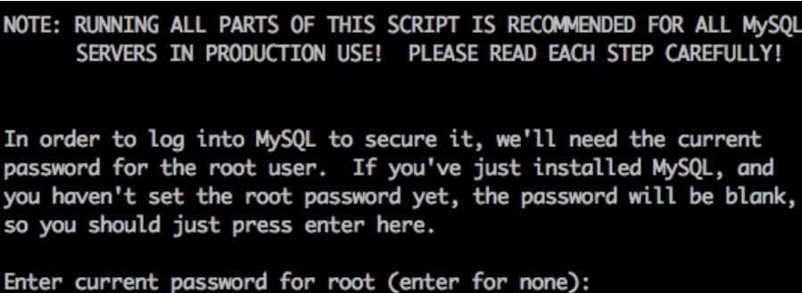
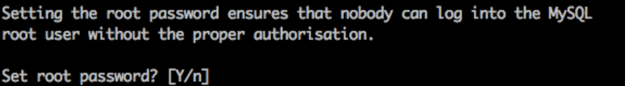
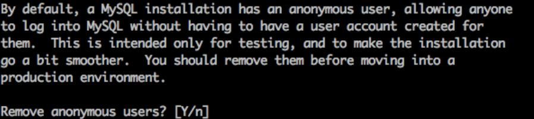
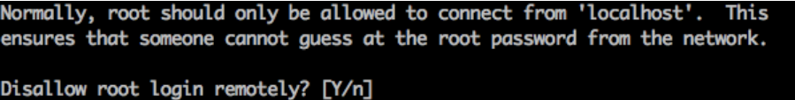
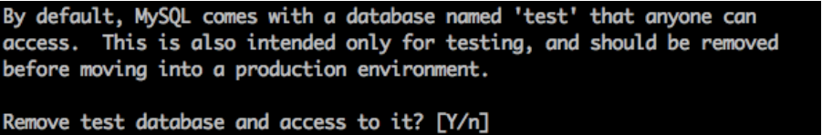
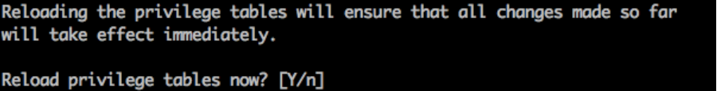
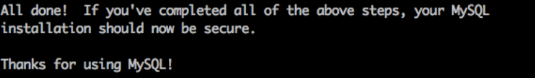

# 安装MySQL

    yum install mysql-server –y

### 设置 MySQL 开机自动启动
    chkconfig mysqld on

### 启动 MySQL 
    service mysqld start

### 配置 MySQL
    mysql_secure_installation
    
** 1） 输入当前的 root 密码，一般密码为空 **  

** 2） 是否设置新的 root 密码，强烈建议设置，输入y **  

** 3）是否移除匿名帐号，请务必移除，否则不用帐号密码就可以进入数据库了，输入y **  

** 4） 是否允许 root 帐号通过远程登录，视需求设定，后续可以修改，输入y **  

** 5） 是否移除 test 数据库，留着也没用，输入y **  

** 6） 是否重新加载特权表，输入y **  

** 7） 设置完成 **  

